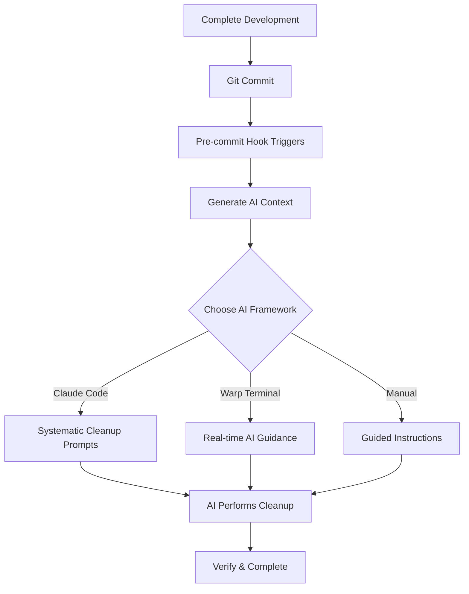

# Cleanup Toolkit

An **AI-powered code cleanup toolkit** that transforms "vibe-coding" "into systematic, intelligent cleanup workflows. Instead of rigid programmatic cleanup, this toolkit **prompts AI frameworks** to perform context-aware code improvement.

[](https://opensource.org/licenses/MIT)
[](https://github.com/nelsojona/cleanup-toolkit)
[](https://github.com/nelsojona/cleanup-toolkit)

## 🤖 The Agentic Approach

This toolkit **doesn't perform cleanup programmatically**. Instead, it:

1. **Analyzes your code changes** and generates intelligent context
2. **Creates AI-specific prompts** for different frameworks  
3. **Guides you through systematic cleanup** using AI assistance
4. **Provides verification workflows** to ensure quality

The AI frameworks do the actual cleanup work, understanding your code's purpose and business logic.

## 🚀 Quick Start

```bash
# Install in your project
curl -sSL https://raw.githubusercontent.com/nelsojona/cleanup-toolkit/main/install.sh | bash

# Or manual install
git clone https://github.com/nelsojona/cleanup-toolkit.git
cd your-project
bash /path/to/cleanup-toolkit/install.sh

# Start coding - cleanup happens automatically on commit!
git add .
git commit -m "feat: implement new feature"
# 🎉 AI cleanup prompts are generated automatically
```

## 🎯 How It Works

### Traditional vs AI-Powered Cleanup

| Traditional Tools | Cleanup Toolkit |
|------------------|-----------------|
| ❌ Rigid, rule-based | ✅ AI-powered, context-aware |
| ❌ Miss nuanced issues | ✅ Understand code intent |
| ❌ Generic formatting only | ✅ Intelligent refactoring |
| ❌ Break functionality | ✅ Preserve business logic |

### The Workflow



## 🤖 AI Framework Support

### 🧠 Claude Code (Recommended)
Perfect for comprehensive project understanding and systematic cleanup.

```bash
# After pre-commit hook triggers:
# 1. Open Claude Code
# 2. Use generated prompts from .cleanup-toolkit/claude-prompts.txt
# 3. Follow systematic cleanup workflow
```

**Features:**
- Project context awareness (claude.md, handover.md)
- Systematic cleanup workflows
- Progress tracking and documentation
- Comprehensive analysis and verification

### ⚡ Warp Terminal AI
Perfect for real-time cleanup guidance with terminal integration.

```bash
# After pre-commit hook triggers:
# 1. Press Cmd+G (or Ctrl+G) in Warp Terminal
# 2. Use prompts from .cleanup-toolkit/warp-ai-prompts.txt
# 3. Get step-by-step cleanup instructions
```

**Features:**
- Real-time AI assistance (Cmd+G)
- Custom workflows for cleanup tasks
- Terminal-integrated analysis
- Multi-pane development environment

### 🔧 Shell Script Fallback
Manual cleanup with guided instructions for any environment.

```bash
# Follow the generated guide
cat .cleanup-toolkit/shell-cleanup-guide.md
```

## 📦 What's Included

### 🪝 **Smart Pre-commit Hook**
- Analyzes code changes intelligently
- Generates AI-specific prompts and context
- Integrates with multiple AI frameworks
- Provides fallback manual guidance

### 🤖 **AI Framework Integration**
- **Claude Code**: Project context + systematic prompts
- **Warp Terminal**: Real-time AI + custom workflows  
- **Shell Scripts**: Manual guidance + checklists

### ⚙️ **Flexible Configuration**
- Framework preferences and settings
- Project-specific cleanup standards
- Team collaboration features
- CI/CD integration ready

### 📚 **Examples & Templates**
- Sample messy code for testing
- Configuration templates (basic, advanced, team)
- Real-world usage examples
- Best practices documentation

## 🔧 Installation & Setup

### One-Line Install
```bash
curl -sSL https://raw.githubusercontent.com/nelsojona/cleanup-toolkit/main/install.sh | bash
```

### Manual Install
```bash
git clone https://github.com/nelsojona/cleanup-toolkit.git
cd your-project
bash /path/to/cleanup-toolkit/install.sh
```

### Verify Installation
```bash
# Test with a messy file
echo "print('debug statement')" > test.py
git add test.py
git commit -m "test: cleanup toolkit"
# Should generate AI prompts and pause commit
```

## 📊 What Gets Cleaned

### Automatically Detected
- ✅ Debug statements (`print()`, `console.log()`, etc.)
- ✅ TODO/FIXME comments
- ✅ Unused imports and variables
- ✅ Duplicate functions
- ✅ Missing documentation
- ✅ Poor error handling

### AI-Powered Improvements
- 🧠 **Intelligent refactoring** based on code purpose
- 🧠 **Context-aware documentation** generation
- 🧠 **Business logic preservation** during cleanup
- 🧠 **Comprehensive error handling** improvements

## 🎨 Language Support

| Language | AI Analysis | Context Understanding | Auto-prompts |
|----------|-------------|----------------------|--------------|
| Python | ✅ Full | ✅ Comprehensive | ✅ Yes |
| JavaScript/TypeScript | ✅ Full | ✅ Comprehensive | ✅ Yes |
| Java | ✅ Good | ✅ Good | ✅ Yes |
| Go | ✅ Good | ✅ Good | ✅ Yes |
| Rust | 🟡 Basic | 🟡 Basic | ✅ Yes |
| Others | 🟡 Generic | 🟡 Generic | ✅ Yes |

## 📚 Examples

### Before Cleanup
```python
import os, sys, json, requests  # Unused imports
def process_user(name, email):
    print(f"Processing: {name}")  # Debug statement
    # TODO: Add validation
    if email:
        return True
    return False

def validate_user(name, email):  # Duplicate logic!
    print(f"Validating: {name}")  # Debug statement  
    if email:
        return True
    return False
```

### After AI Cleanup
```python
"""User processing utilities with comprehensive validation."""

from typing import Optional


def process_user(name: str, email: str) -> bool:
    """
    Process and validate user information.
    
    Args:
        name: User's full name
        email: User's email address
        
    Returns:
        bool: True if user is valid and processed successfully
        
    Raises:
        ValueError: If name is empty or email is invalid
    """
    if not name.strip():
        raise ValueError("Name cannot be empty")
    
    if not email or '@' not in email:
        raise ValueError("Invalid email address")
    
    # Process user logic here
    return True
```

## ⚙️ Configuration

### Basic Configuration
```yaml
# .cleanup-toolkit/config.yml
cleanup_mode: "agentic"
preferred_framework: "claude-code"  # or "warp-terminal"
auto_generate_prompts: true

claude_code:
  update_handover: true
  generate_context: true

warp_terminal:
  enable_workflows: true
  create_ai_context: true
```

### Team Configuration
```yaml
# Team-specific settings
team:
  enforce_standards: true
  require_review: true
  shared_prompts: true

quality_gates:
  max_file_lines: 250
  require_docstrings: true
  min_test_coverage: 80
```

## 🔍 Troubleshooting

### Common Issues

**Pre-commit hook not running:**
```bash
# Check installation
ls -la .git/hooks/pre-commit
# Reinstall if needed
bash /path/to/cleanup-toolkit/install.sh
```

**AI framework not detected:**
```bash
# Claude Code
test -f claude.md && echo "✅ Ready" || echo "❌ Run install.sh"

# Warp Terminal  
test -d .warp && echo "✅ Ready" || echo "❌ Run warp-init.sh"
```

**Skip cleanup for specific commits:**
```bash
# Method 1: Environment variable
SKIP_CLEANUP=true git commit -m "wip: work in progress"

# Method 2: Commit message marker
git commit -m "feat: new feature SKIP_CLEANUP"

# Method 3: No-verify flag
git commit --no-verify -m "emergency fix"
```

## 📖 Documentation

- [Quick Start Guide](docs/quick-start.md)
- [Claude Code Integration](claude-code/agentic-prompts.md)
- [Warp Terminal Workflows](warp-terminal/agentic-workflows.md)
- [Configuration Reference](docs/configuration.md)
- [Team Setup Guide](examples/team-setup/)
- [Contributing Guidelines](CONTRIBUTING.md)

## 🤝 Contributing

We welcome contributions! This toolkit is designed to be extensible and community-driven.

### Ways to Contribute
- 🤖 Add new AI framework integrations
- 📝 Improve prompt templates and workflows
- 🔧 Enhance context generation and analysis
- 📚 Add examples and documentation
- 🐛 Fix bugs and improve reliability

See [CONTRIBUTING.md](CONTRIBUTING.md) for detailed guidelines.

## 📄 License

This project is licensed under the MIT License - see the [LICENSE](LICENSE) file for details.

## 🙏 Acknowledgments

- **Anthropic** for Claude's intelligent code understanding capabilities
- **Warp Terminal** for modern terminal AI integration
- **The open source community** for feedback, contributions, and continuous improvement

## 🔗 Links

- [GitHub Repository](https://github.com/nelsojona/cleanup-toolkit)
- [Issues & Support](https://github.com/nelsojona/cleanup-toolkit/issues)
- [Discussions](https://github.com/nelsojona/cleanup-toolkit/discussions)

---

*Transform your development workflow with AI-powered systematic code cleanup. Because intelligent cleanup is better than automated cleanup! 🤖✨*

