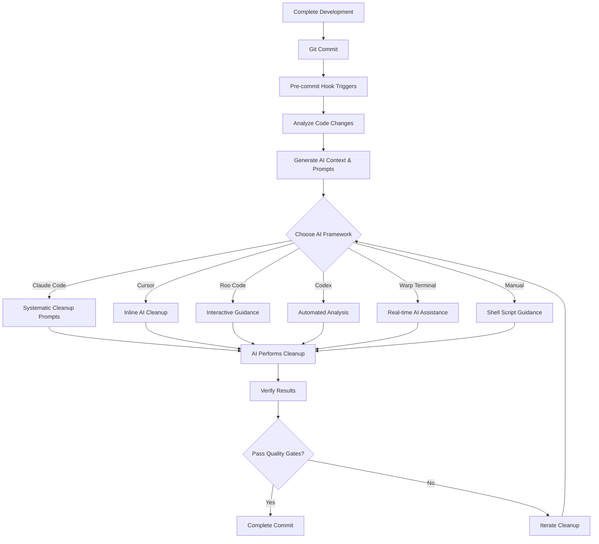

# Cleanup Toolkit

An **AI-powered code cleanup toolkit** that transforms "vibe-coding" into systematic, intelligent cleanup workflows. Instead of rigid programmatic cleanup, this toolkit **prompts AI frameworks** to perform context-aware code improvement.

[](https://opensource.org/licenses/MIT)
[](https://github.com/nelsojona/cleanup-toolkit)
[](https://github.com/nelsojona/cleanup-toolkit)

## 🤖 The Agentic Approach

This toolkit **doesn't perform cleanup programmatically**. Instead, it:

1. **Analyzes your code changes** and generates intelligent context
2. **Creates AI-specific prompts** for different frameworks  
3. **Guides you through systematic cleanup** using AI assistance
4. **Provides verification workflows** to ensure quality

The AI frameworks do the actual cleanup work, understanding your code's purpose and business logic.

## 🚀 Quick Start

```bash
# Clone the toolkit
git clone https://github.com/nelsojona/cleanup-toolkit.git

# Install in your project (from project root)
cd your-project
bash /path/to/cleanup-toolkit/install.sh

# The installer will:
# 1. Create .cleanup-toolkit/ directory
# 2. Install pre-commit hook
# 3. Copy configuration templates
# 4. Set up AI framework integrations

# Start coding - cleanup happens automatically on commit!
git add .
git commit -m "feat: implement new feature"
# 🎉 AI cleanup prompts are generated automatically
```

### Quick Install (One-liner)
```bash
curl -sSL https://raw.githubusercontent.com/nelsojona/cleanup-toolkit/main/install.sh | bash
```

## 🎯 How It Works

### Traditional vs AI-Powered Cleanup

| Traditional Tools | Cleanup Toolkit |
|------------------|-----------------|
| ❌ Rigid, rule-based | ✅ AI-powered, context-aware |
| ❌ Miss nuanced issues | ✅ Understand code intent |
| ❌ Generic formatting only | ✅ Intelligent refactoring |
| ❌ Break functionality | ✅ Preserve business logic |

### The Workflow



## 🤖 AI Framework Support

### 🔮 OpenAI Codex (NEW!)
Powerful code understanding and generation for intelligent cleanup.

```bash
# After pre-commit hook triggers:
# 1. Set OPENAI_API_KEY environment variable
# 2. Run Codex cleanup scripts
# 3. Review and apply AI-generated improvements
```

**Features:**
- Deep code comprehension
- Context-aware refactoring  
- Automated documentation generation
- Multi-language support

[📖 Full Codex Integration Guide](docs/codex-integration.md)

### 🚀 Roo Code
AI-powered development environment with deep code understanding.

```bash
# After pre-commit hook triggers:
# 1. Open Roo Code workspace
# 2. Use AI assistant for comprehensive analysis
# 3. Follow interactive cleanup guidance
```

**Features:**
- Full project context awareness
- Interactive AI-guided cleanup
- Learning from cleanup patterns
- Cross-file analysis and refactoring

[📖 Full Roo Code Integration Guide](docs/roo-code-integration.md)

### 🎨 Cursor
AI-powered code editor with intelligent cleanup capabilities.

```bash
# After pre-commit hook triggers:
# 1. Open files in Cursor
# 2. Use Cmd+L for comprehensive analysis
# 3. Use Cmd+K for targeted fixes
```

**Features:**
- AI-powered context understanding
- Inline and chat-based cleanup
- Multi-file editing capabilities
- Custom cleanup commands

[📖 Full Cursor Integration Guide](docs/cursor-integration.md)

### 🧠 Claude Code (Recommended)
Perfect for comprehensive project understanding and systematic cleanup.

```bash
# After pre-commit hook triggers:
# 1. Open Claude Code
# 2. Use generated prompts from .cleanup-toolkit/claude-prompts.txt
# 3. Follow systematic cleanup workflow
```

**Features:**
- Project context awareness (claude.md, handover.md)
- Systematic cleanup workflows
- Progress tracking and documentation
- Comprehensive analysis and verification

### ⚡ Warp Terminal AI
Perfect for real-time cleanup guidance with terminal integration.

```bash
# After pre-commit hook triggers:
# 1. Press Cmd+G (or Ctrl+G) in Warp Terminal
# 2. Use prompts from .cleanup-toolkit/warp-ai-prompts.txt
# 3. Get step-by-step cleanup instructions
```

**Features:**
- Real-time AI assistance (Cmd+G)
- Custom workflows for cleanup tasks
- Terminal-integrated analysis
- Multi-pane development environment

### 🔧 Shell Script Fallback
Manual cleanup with guided instructions for any environment.

```bash
# Follow the generated guide
cat .cleanup-toolkit/shell-cleanup-guide.md
```

### 🚀 More Integrations
- **VS Code**: Coming soon
- **IntelliJ IDEA**: Coming soon
- **Sublime Text**: Coming soon

## 📦 What's Included

### Core Components

#### 🪝 **Smart Pre-commit Hook** (`hooks/pre-commit`)
- Analyzes git staged changes using `git diff --cached`
- Detects code quality issues (debug statements, TODOs, unused imports)
- Generates AI-specific prompts for each framework
- Creates contextual cleanup guidance
- Supports skip conditions (`SKIP_CLEANUP`, `--no-verify`)

#### 🧹 **Code Cleanup Script** (`scripts/code_cleanup_gist.sh`)
- Standalone cleanup analysis tool
- Language-specific pattern detection
- Quality metrics generation
- Manual cleanup workflow support

#### ⚙️ **Configuration System**
- YAML-based configuration (`config.yml`)
- Per-project settings (`.cleanup-toolkit/`)
- Framework-specific configurations
- Team collaboration templates

### AI Framework Integrations

#### 📁 **Framework-Specific Configs**
- `claude-code/`: Claude Code prompts and workflows
- `cursor-config/`: Cursor settings and cleanup prompts
- `codex-config/`: OpenAI Codex scripts and prompts
- `roo-config/`: Roo Code workflows and templates
- `warp-terminal/`: Warp AI workflows and guides

#### 📚 **Example Projects**
- `examples/python-project/`: Python cleanup examples
- `examples/javascript-project/`: JS/TS cleanup examples
- `examples/config-templates/`: Basic and advanced configs
- `examples/team-setup/`: Team collaboration setup

### Testing & Quality
- `tests/`: Comprehensive test suite
  - Unit, integration, E2E, performance, security tests
  - Test fixtures for various scenarios

## 🔧 Installation & Setup

### Prerequisites
- Git repository initialized in your project
- Bash shell (macOS, Linux, WSL on Windows)
- One or more AI frameworks installed (Claude Code, Cursor, etc.)

### Installation Methods

#### Method 1: Quick Install
```bash
curl -sSL https://raw.githubusercontent.com/nelsojona/cleanup-toolkit/main/install.sh | bash
```

#### Method 2: Manual Install
```bash
# Clone the toolkit
git clone https://github.com/nelsojona/cleanup-toolkit.git

# Navigate to your project
cd your-project

# Run the installer
bash /path/to/cleanup-toolkit/install.sh
```

### What Gets Installed
```
your-project/
├── .cleanup-toolkit/          # Toolkit configuration directory
│   ├── config.yml            # Your project configuration
│   ├── claude-prompts.txt    # Generated Claude Code prompts
│   ├── warp-ai-prompts.txt   # Generated Warp prompts
│   └── cleanup-report.md     # Cleanup analysis reports
├── .git/hooks/
│   └── pre-commit            # Smart pre-commit hook
└── claude.md (optional)      # Claude Code context file
```

### Verify Installation
```bash
# Check hook installation
ls -la .git/hooks/pre-commit

# Test with a sample commit
echo "print('debug statement')" > test.py
git add test.py
git commit -m "test: cleanup toolkit"
# Should trigger cleanup analysis and generate AI prompts
```

## 📊 What Gets Cleaned

### Automatically Detected
- ✅ Debug statements (`print()`, `console.log()`, etc.)
- ✅ TODO/FIXME comments
- ✅ Unused imports and variables
- ✅ Duplicate functions
- ✅ Missing documentation
- ✅ Poor error handling

### AI-Powered Improvements
- 🧠 **Intelligent refactoring** based on code purpose
- 🧠 **Context-aware documentation** generation
- 🧠 **Business logic preservation** during cleanup
- 🧠 **Comprehensive error handling** improvements

## 🎨 Language Support

| Language | AI Analysis | Context Understanding | Auto-prompts |
|----------|-------------|----------------------|--------------|
| Python | ✅ Full | ✅ Comprehensive | ✅ Yes |
| JavaScript/TypeScript | ✅ Full | ✅ Comprehensive | ✅ Yes |
| Java | ✅ Good | ✅ Good | ✅ Yes |
| Go | ✅ Good | ✅ Good | ✅ Yes |
| Rust | 🟡 Basic | 🟡 Basic | ✅ Yes |
| Others | 🟡 Generic | 🟡 Generic | ✅ Yes |

## 📚 Examples

### Before Cleanup
```python
import os, sys, json, requests  # Unused imports
def process_user(name, email):
    print(f"Processing: {name}")  # Debug statement
    # TODO: Add validation
    if email:
        return True
    return False

def validate_user(name, email):  # Duplicate logic!
    print(f"Validating: {name}")  # Debug statement  
    if email:
        return True
    return False
```

### After AI Cleanup
```python
"""User processing utilities with comprehensive validation."""

from typing import Optional


def process_user(name: str, email: str) -> bool:
    """
    Process and validate user information.
    
    Args:
        name: User's full name
        email: User's email address
        
    Returns:
        bool: True if user is valid and processed successfully
        
    Raises:
        ValueError: If name is empty or email is invalid
    """
    if not name.strip():
        raise ValueError("Name cannot be empty")
    
    if not email or '@' not in email:
        raise ValueError("Invalid email address")
    
    # Process user logic here
    return True
```

## ⚙️ Configuration

### Basic Configuration
```yaml
# .cleanup-toolkit/config.yml
# General settings
cleanup_enabled: true
auto_fix_enabled: true
documentation_required: false

# Integration settings
preferred_framework: "claude-code"  # Options: claude-code, cursor, roo-code, codex, warp-terminal, shell
shell_script_enabled: true
claude_code_enabled: true
warp_terminal_enabled: false

# Language-specific settings
python:
  use_black: false
  use_isort: false
  use_autoflake: false
  
javascript:
  use_prettier: false
  use_eslint: false

# Quality checks
max_file_lines: 1000
max_function_lines: 100
require_docstrings: false

# Pre-commit settings
fail_on_warnings: false
generate_reports: true
update_handover: false
```

### Advanced Configuration
```yaml
# Advanced team configuration
cleanup_mode: "agentic"
preferred_framework: "claude-code"
auto_generate_prompts: true

# Framework-specific settings
claude_code:
  update_handover: true
  generate_context: true
  systematic_workflow: true

cursor:
  inline_cleanup: true
  use_cmd_k: true
  use_cmd_l: true

roo_code:
  interactive_mode: true
  full_context: true

codex:
  api_key: "${OPENAI_API_KEY}"
  model: "code-davinci-002"
  temperature: 0.2

warp_terminal:
  enable_workflows: true
  create_ai_context: true
  use_cmd_g: true

# Quality gates
quality_gates:
  max_file_lines: 250
  max_function_lines: 50
  max_complexity: 10
  require_docstrings: true
  min_test_coverage: 80

# Team collaboration
team:
  enforce_standards: true
  require_review: true
  shared_prompts: true
  central_config_repo: "https://github.com/team/cleanup-standards"
```

## 🔍 Troubleshooting

### Common Issues

**Pre-commit hook not running:**
```bash
# Check installation
ls -la .git/hooks/pre-commit
# Reinstall if needed
bash /path/to/cleanup-toolkit/install.sh
```

**AI framework not detected:**
```bash
# Claude Code
test -f claude.md && echo "✅ Ready" || echo "❌ Run install.sh"

# Warp Terminal  
test -d .warp && echo "✅ Ready" || echo "❌ Run warp-init.sh"
```

**Skip cleanup for specific commits:**
```bash
# Method 1: Environment variable
SKIP_CLEANUP=true git commit -m "wip: work in progress"

# Method 2: Commit message marker
git commit -m "feat: new feature SKIP_CLEANUP"

# Method 3: No-verify flag
git commit --no-verify -m "emergency fix"
```

## 📖 Documentation

### Core Documentation
- [Quick Start Guide](docs/quick-start.md)
- [Configuration Reference](docs/configuration.md)
- [Contributing Guidelines](CONTRIBUTING.md)

### AI Framework Guides
- [OpenAI Codex Integration](docs/codex-integration.md)
- [Roo Code Integration Guide](docs/roo-code-integration.md)
- [Cursor Integration Guide](docs/cursor-integration.md)
- [Claude Code Integration](claude-code/agentic-prompts.md)
- [Warp Terminal Workflows](warp-terminal/agentic-workflows.md)

### Examples & Templates
- [Python Project Example](examples/python-project/)
- [JavaScript Project Example](examples/javascript-project/)
- [Cursor Configuration](examples/cursor-config/)
- [Codex Configuration](examples/codex-config/)
- [Roo Configuration](examples/roo-config/)
- [Team Setup Guide](examples/team-setup/)
- [Configuration Templates](examples/config-templates/)

## 🤝 Contributing

We welcome contributions! This toolkit is designed to be extensible and community-driven.

### Ways to Contribute
- 🤖 Add new AI framework integrations
- 📝 Improve prompt templates and workflows
- 🔧 Enhance context generation and analysis
- 📚 Add examples and documentation
- 🐛 Fix bugs and improve reliability

See [CONTRIBUTING.md](CONTRIBUTING.md) for detailed guidelines.

## 📄 License

This project is licensed under the MIT License - see the [LICENSE](LICENSE) file for details.

## 🙏 Acknowledgments

- **OpenAI** for Codex's powerful code understanding and generation capabilities
- **Roo Code** for deep project context awareness and interactive AI guidance
- **Cursor** for AI-powered code editing with inline cleanup features
- **Anthropic** for Claude's intelligent code understanding capabilities
- **Warp Terminal** for modern terminal AI integration
- **The open source community** for feedback, contributions, and continuous improvement

## 🔗 Links

- [GitHub Repository](https://github.com/nelsojona/cleanup-toolkit)
- [Issues & Support](https://github.com/nelsojona/cleanup-toolkit/issues)
- [Discussions](https://github.com/nelsojona/cleanup-toolkit/discussions)

---

*Transform your development workflow with AI-powered systematic code cleanup. Because intelligent cleanup is better than automated cleanup! 🤖✨*

